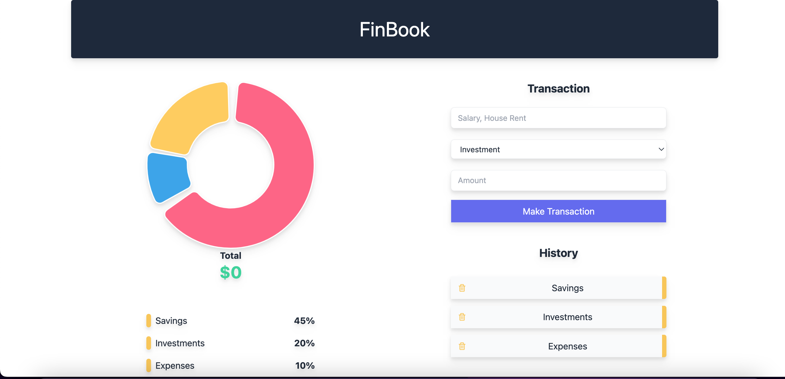

# Building a Personal Finanical App

  

## About

The project involves building a financial app using the MERN stack - MongoDB, Express, React, and Node.js - with the addition of PostgreSQL as the database. The app is designed to help users track their expenses, manage their finances, and monitor their budget.

The front-end of the app is built using React.js, a popular JavaScript library for building user interfaces. React enables the creation of dynamic, interactive, and responsive web applications. Node.js is used for the back-end, providing a scalable and robust server-side environment that can handle multiple requests concurrently.

PostgreSQL is used as the database for storing user data, including transaction histories, account balances, and other financial information. PostgreSQL is known for its stability, reliability, and scalability, making it an ideal choice for financial applications that require a high level of data security and integrity.

Overall, the project provides an opportunity to gain hands-on experience building a full-stack web application using industry-standard technologies, with a focus on financial management and user experience. By completing this project, learners will develop skills in React.js, Node.js, PostgreSQL, and web development best practices.
